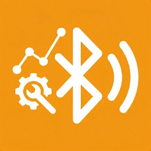

# NapicuBLEHub [Beta]

<h1 align="center">

  
</h1>


[](https://github.com/Numax-cz/NapicuBLEHub/actions/workflows/docker.yml)
[](https://hub.docker.com/r/numaxcz/napicublehub)
[](https://app.codacy.com/gh/Numax-cz/NapicuBLEHub/dashboard?utm_source=gh&utm_medium=referral&utm_content=&utm_campaign=Badge_grade)

A Bluetooth Low Energy (BLE) Device Debugging and Testing Tool for Developers

This project is a debugging, analysis, and testing tool designed specifically for **Bluetooth Low Energy (BLE)**
devices, primarily aimed at developers. It is built using [NextJS](https://nextjs.org/) and
the [@abandonware/noble](https://www.npmjs.com/package/@abandonware/noble) library to interact with BLE devices.
## Features


- **Bluetooth Low Energy (BLE) Device Interaction**: The tool allows developers to:
    - Write data to BLE devices
    - Read data from BLE devices
    - Subscribe to BLE device notifications

- **Intuitive Web-based UI**: The tool provides an easy-to-use web interface for interacting with BLE devices. The UI is
  designed to be straightforward, enabling efficient debugging and testing. It offers a clickable interface for those
  who prefer a graphical way to interact with devices.

- **Web-based Terminal**: In addition to the clickable UI, the tool also supports commands via a web terminal, allowing
  users to interact with BLE devices through a command-line interface. This offers more flexibility for advanced users
  who prefer working with commands.

- **Device Connection**: The BLE device connects directly to the machine where the program is running. This means that
  the tool operates as a local interface for managing BLE connections, and the connected device will be mirrored across
  all web clients accessing the program via the same network.

- **Web Server Access**: The program runs as a web application accessible at the IP address where the tool is hosted.
  This allows easy access to the tool from any device on the same network.

- **Cross-Platform Support**: The tool supports Linux, macOS and Windows, and while it is designed for these platforms.

- **Single Connection Support**: The tool supports only one BLE device connection at a time. Once a device is connected,
  it is mirrored on the web interface. This means that the same connected device will be displayed across all instances
  of the web page that are opened on other devices. This is useful for monitoring and debugging the same BLE device
  across multiple devices.
---

## 🧪 Tested Platforms

The application has been tested on the following operating systems and kernel versions.

| Operating System | Version / Kernel | Status |
|---|---|---|
| macOS | macOS 26.5 | ✅ Tested |
| Fedora Linux | Linux Kernel 6.19 | ✅ Tested |
| Debian 13 (Trixie) | Linux Kernel 6.12.88 | ✅ Tested |
| Windows | Windows 11 | ✅ Tested |

> ⚠️ Linux is currently the recommended and most reliable platform for BLE functionality.

> 🧠 Docker BLE support was primarily tested on Linux systems using the BlueZ Bluetooth stack.


---
## Installation

Source: [@abandonware/noble](https://www.npmjs.com/package/@abandonware/noble)


### Prerequisites

By default, the Bluetooth adapter is selected as `hci0`.
To change the adapter, [check the multiple adapters section](#multiple-adapters-linux-specific).

#### Windows

Require cross-env:
```bash
npm install --save-dev cross-env
```

Require [chocolatey](https://chocolatey.org/)

Install python and visualstudio2022-workload-vctools:
```bash
choco install python visualstudio2022-workload-vctools -y 
```

To run dev and start on Windows, you have to use cross-env:
"dev": "cross-env NOBLE_HCI_DEVICE_ID=0 NAPICU_SERVER_LOG_LEVEL=2 next dev -p 6969 -H 0.0.0.0"
"build": "cross-env NOBLE_HCI_DEVICE_ID=0 NAPICU_SERVER_LOG_LEVEL=2 next build"

#### macOS

1. Install [Xcode](https://itunes.apple.com/ca/app/xcode/id497799835?mt=12).
2. In newer macOS, allow Bluetooth access:
   - Navigate to "System Preferences" → "Security & Privacy" → "Bluetooth".
   - Add the terminal app (see [Sandboxed terminal](#sandboxed-terminal)).

#### Linux

* Kernel version 3.6 or above.
* `libbluetooth-dev` must be installed. Instructions for specific distributions are below.
* To set the necessary privileges to run without
  sudo, [see this section](https://www.npmjs.com/package/@abandonware/noble#running-without-rootsudo-linux-specific).
  This is required for all distributions (Raspbian, Ubuntu, Fedora, etc). You will not get any errors if running without
  sudo, but nothing will happen.

#### Ubuntu, Debian, Raspbian

Refer to [generic Linux notes above](#linux).

```sh
sudo apt-get install bluetooth bluez libbluetooth-dev libudev-dev
```

Make sure `node` is on your `PATH`. If it's not, some options:

* [Install Node.js via NodeSource Package](https://nodejs.org/en/download/package-manager/#debian-and-ubuntu-based-linux-distributions)
* [Install Node.js using the NodeSource package](https://nodejs.org/en/download/package-manager/#debian-and-ubuntu-based-linux-distributions)

If you are having trouble connecting to BLE devices on a Raspberry Pi, you should disable the `pnat` plugin. Add the
following line at the bottom of `/etc/bluetooth/main.conf`:

```
DisablePlugins=pnat
```

Then restart the system.

See [Issue #425 · OpenWonderLabs/homebridge-switchbot](https://github.com/OpenWonderLabs/homebridge-switchbot/issues/425#issuecomment-1190864279).

#### Fedora and RPM-based Distributions

Refer to [generic Linux notes above](#linux).

```sh
sudo dnf install bluez bluez-libs bluez-libs-devel systemd-devel
```

##### Intel Edison

See the [generic Linux notes above](#linux) first.

For reference: [Configuring Intel Edison for BLE Development](http://rexstjohn.com/configure-intel-edison-for-bluetooth-le-smart-development/).

#### FreeBSD

Make sure you have GNU Make:

```sh
sudo pkg install gmake
```

Disable the default Bluetooth stack:
1. Add [no-ubt.conf](https://gist.github.com/myfreeweb/44f4f3e791a057bc4f3619a166a03b87) to `/usr/local/etc/devd/no-ubt.conf`.
2. Restart devd with `sudo service devd restart`.

Unload `ng_ubt` kernel module if already loaded:

```sh
sudo kldunload ng_ubt
```

Make sure you have read and write permissions on the `/dev/usb/*` device that corresponds to your Bluetooth adapter.

---
### Multiple Bluetooth Adapters (Linux)

Default Adapter: `hci0`
`hci0` is used by default.

To override, set the `NOBLE_HCI_DEVICE_ID` environment variable to the interface number.

For example, to specify `hci1`:

```sh
sudo NOBLE_HCI_DEVICE_ID=1 node <your file>.js
```

### Reporting all HCI events (Linux-specific)

By default, noble waits for both the advertisement data and scan response data for each Bluetooth address. If your
device does not use scan response, the `NOBLE_REPORT_ALL_HCI_EVENTS` environment variable can be used to bypass it.

```sh
sudo NOBLE_REPORT_ALL_HCI_EVENTS=1 node <your file>.js
```

### bleno compatibility (Linux-specific)

By default, noble will respond with an error whenever a GATT request message is received. If your intention is to use
bleno in tandem with noble, the `NOBLE_MULTI_ROLE` environment variable can be used to bypass this behaviour.

__Note:__ this requires a Bluetooth 4.1 adapter.

```sh
sudo NOBLE_MULTI_ROLE=1 node <your file>.js
```

---

## Development & Deployment

Available scripts are listed in `package.json`.

#### Start Application - Production mode

```
sudo npm run start
```

#### Start Application - Development mode

```
sudo npm run dev
```

#### Application build

```
sudo npm run build
```

---

## CLI Guide

For more commands and options, refer to the official
documentation: [Next.js CLI Reference](https://nextjs.org/docs/pages/api-reference/cli/next).

```bash
"dev": "NOBLE_HCI_DEVICE_ID=0 NAPICU_SERVER_LOG_LEVEL=2 next dev -p 6969 -H 0.0.0.0",
"build": "NOBLE_HCI_DEVICE_ID=0 NAPICU_SERVER_LOG_LEVEL=2 next build",
"start": "next start -H 0.0.0.0"
```

### `NOBLE_HCI_DEVICE_ID=0`

This parameter specifies the Bluetooth adapter to be used. NOBLE_HCI_DEVICE_ID=0 means that the adapter with ID 0 will
be selected. This adapter is used for communication with Bluetooth Low Energy (BLE) devices.

### `NAPICU_SERVER_LOG_LEVEL=2`

This parameter defines the log level for console output:

* `-1` - Disables all logs (no logs will be shown).
* `1` - Only error logs will be shown.
* `2` - Shows error, success, and informational logs.

---


## 🐳 Docker Setup

The application can also be run using Docker, which provides a simple and consistent deployment environment for the BLE backend server and Next.js application.

⚠️ This setup relies on direct access to the host machine’s Bluetooth stack and is therefore recommended for Linux systems only.


### ⚠️ Requirements (IMPORTANT)

For Bluetooth Low Energy (BLE) to work inside Docker, the following is required on the host machine (NOT inside the container)

### Ubuntu / Debian
Install required Bluetooth system dependencies:
```bash
sudo apt-get update
sudo apt-get install bluetooth bluez libbluetooth-dev libudev-dev
```
These packages provide the BlueZ Bluetooth stack, which is required by [@abandonware/noble](https://www.npmjs.com/package/@abandonware/noble).

### Fedora / RPM-based distributions
Install required Bluetooth system dependencies:
```bash
sudo dnf install bluez bluez-libs bluez-libs-devel systemd-devel
```

### ❗ Important Notes

* Docker does NOT provide Bluetooth hardware access by itself
* The container relies on the host system’s Bluetooth adapter
* BLE will NOT work on Windows or macOS Docker Desktop reliably
* Linux is the only fully supported environment


### 📦 Run via Docker (Recommended)
▶️ Pull prebuilt image (GitHub Container Registry)
```bash
docker pull ghcr.io/numax-cz/napicublehub:latest
```

### 🚀 Run container (default configuration)
```bash
docker run \
  -p 6969:6969 \
  --net=host \
  --privileged \
  ghcr.io/numax-cz/napicublehub:latest
```
Default values:
* PORT: 6969
* BLE HCI device: 0
* Log level: 2

### ⚙️ Run container with custom configuration
You can override default settings using environment variables:
```bash
docker run \
  -p 8080:8080 \
  --net=host \
  --privileged \
  -e PORT=8080 \
  -e NOBLE_HCI_DEVICE_ID=1 \
  -e NAPICU_SERVER_LOG_LEVEL=1 \
  ghcr.io/numax-cz/napicublehub:latest
```

### 🛠️ Build Docker image locally
If you want to build the project yourself:
```bash
docker build -t napicublehub .
```

### ▶️ Run locally built image
```bash
docker run \
  -p 6969:6969 \
  --net=host \
  --privileged \
  napicublehub
```

---

## 🔧 Docker Flags Explained

### `--privileged`
Grants the container elevated permissions.

This is required for BLE functionality because it allows:

* Access to /dev/hci0
* Direct communication with Bluetooth hardware
* Interaction with the host’s BlueZ stack

⚠️ Without this flag, BLE scanning and device communication will NOT work.

### `--net=host (Linux only)`
This makes the container share the host network stack.

Benefits:

* Improved BLE stability
* Direct access to host Bluetooth interfaces
* No NAT/network isolation issues

👉 Recommended for production Linux deployments.

---

## 🚀 Docker summary 

* Docker provides a convenient deployment method
* BLE access depends on the host system (not Docker itself)
* Linux is strongly recommended and fully supported
* Proper permissions (--privileged) are required for BLE functionality

---


## 💻 Console / Terminal Commands
The application includes a built-in web-based console (terminal) that allows direct interaction with BLE devices.

This console provides a simple command interface for reading, writing, and managing BLE characteristics in real time.

### 📡 `subscribe` (alias: `sub`)
Subscribe to notifications from a BLE characteristic.

```bash
subscribe <uuid>
```
`uuid` - The characteristic UUID to subscribe to

### 📡 `unsubscribe` (alias: `un`)
Unsubscribe from notifications of a BLE characteristic.

```bash
unsubscribe <uuid>
```
`uuid` - The characteristic UUID to unsubscribe from


### ✍️ `write`
Write data to a BLE characteristic.
```bash
write <uuid> <message>
```
`uuid` - The characteristic UUID to write to
`message` - Data to send to the characteristic

### 📖 `read`
Read data from a BLE characteristic.
```bash
read <uuid>
```
`uuid` - The characteristic UUID to read from

### 🧹 `clear` (alias: `cl`)
Clears the console output.
```bash
clear
```

### 🗑️ `delete` (alias: `dl`)
Removes stored application settings.
```bash
delete <option>
```

| Option  | Description |
|----------|-------------|
| aliases  | Removes all aliases for services and characteristics |
| sizes    | Removes saved window layout settings |
| all      | Removes all user settings |

### 🧠 Notes

* UUID must match a valid BLE characteristic on the connected device
* Write operations depend on characteristic permissions
* Subscribe enables real-time notifications from BLE devices
* All commands are executed against the currently connected device

### 🚀 Example usage
```bash
subscribe 12345678-1234-1234-1234-123456789abc
read 12345678-1234-1234-1234-123456789abc
write 12345678-1234-1234-1234-123456789abc hello
clear
```

---

## 🐛 Bug Reports

If you encounter any issues or bugs, please report them here:

https://github.com/Numax-cz/NapicuBLEHub/issues

Make sure to include as much detail as possible (steps to reproduce, expected behavior, and screenshots if applicable).
This helps improve the project significantly 👍
